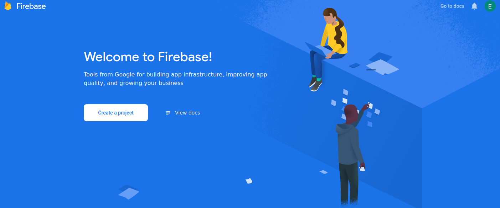
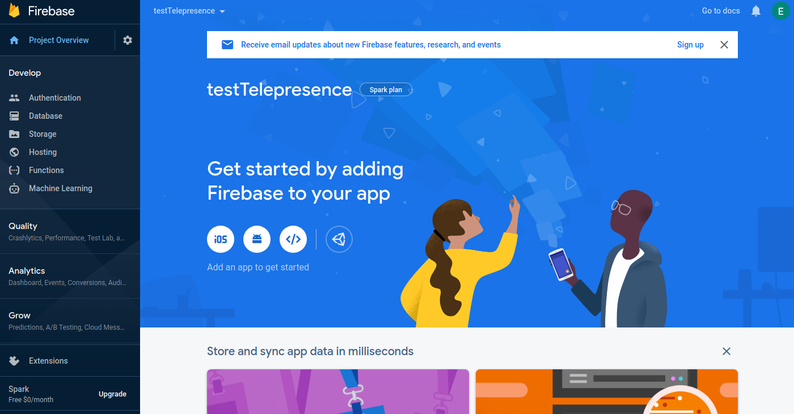
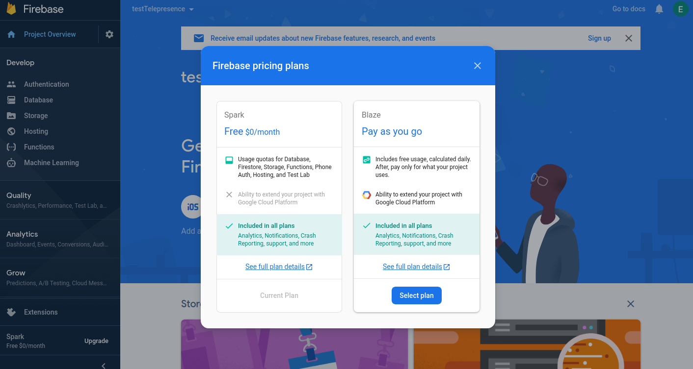
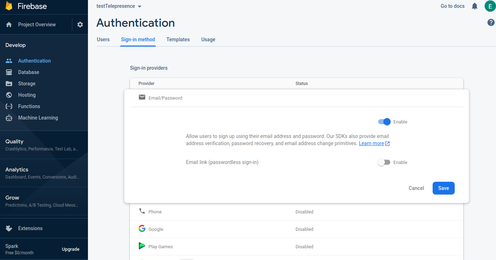
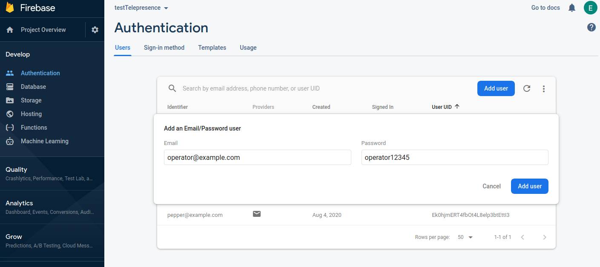

# Create and setup a Firebase account

This repository contains a web application and an api that you can host on [Firebase cloud](https://firebase.google.com/) to mimic a production like deployment. Once deployed on Firebase cloud, you will be able to access the web app from anywhere, and take control of Pepper from distant places over the internet. 

You will need to create a Pay-as-you-go Firebase account (so you will need a credit card). Firebase provides a free tier, and you won't have to pay if you use it just to test the app as the quotas are [quite large](https://firebase.google.com/pricing).

In this project we use:

* [Firebase Hosting](https://firebase.google.com/docs/hosting) to host the web app in the cloud
* [Firebase Functions](https://firebase.google.com/docs/functions/) to host the REST api used by the Web app and the Android app to retrieve Twilio Tokens (allowing to connect to Twilio Cloud)
* [Firebase Authentication](https://firebase.google.com/docs/auth/) to provide login pages and authenticate requests to Firebase functions.

Let's create a Firebase project and configure it.

## Create a project

Create a Firebase account, log in, then go to [Firebase console](https://console.firebase.google.com/) and click on *Create a project*:

  

Then enter a project name, accept Firebase terms of use, and click *Continue*.
Disable Google Analytics (unless you plan on using it in your project, it is out of the scope of this README), and finally click *Create Project*.

You should now land on the Firebase console for your project.

  

## Configure Pay as you go Account

Firebase requires that you configure a Pay as you go account ("Blaze" plan) in order to use Firebase Functions and Hosting. By default your account is using the "Spark" plan, which is free.
Click on *Upgrade* button, next to the "Spark" mention, in the menu at the bottom left of the screen, this opens a popup with Firebase pricing plans. Click on *Select plan* under the *Blaze* section, and fill in all the required informations, as well as your credit card number.

  

## Configure Firebase Authentication

### Activate Email/Password login

The web application and the Android app use Firebase Authentication, in order to log you in and allow you to access the REST Api deployed on Firebase Functions. Firebase Authentication provide many login methods. We will use the email and password login method.

In Firebase console left menu, click on *Develop* > *Authentication* > *Sign-in method*

Then in the list of Sign-in providers, click on *Email/Password* and toggle the *Enable* button. Leave the *Email link* disabled, and click on *Save*.

  

### Add Email/Password accounts

Now you need to add accounts, that you will use to login. Click on *Sign in method* then click on *Add User*. Enter an email and a password, and click on the *Add user* button. You will not see the password once it has been set, so make sure you remember it. Alternatively, enable the option within Firebase to allow the user to set their own password.

  

Repeat the operation a second time, so that you have at least two accounts created.
In the example above, we created two accounts: pepper@example.com and operator@example.com.
We will use the first one to log in the Android app, and the second one to log in the Web app.

