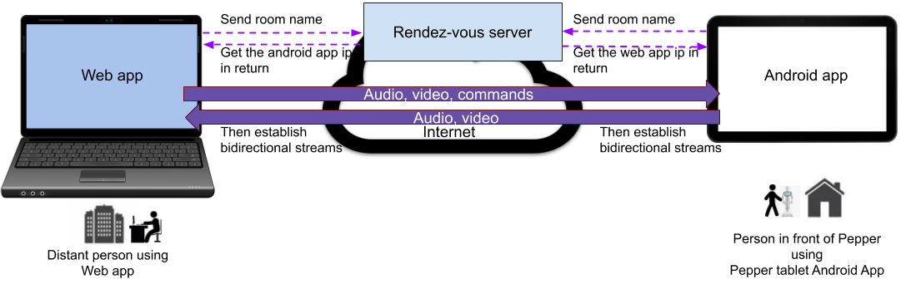
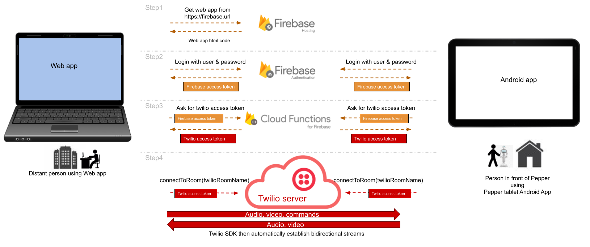
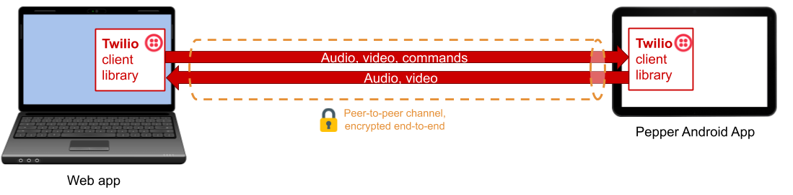
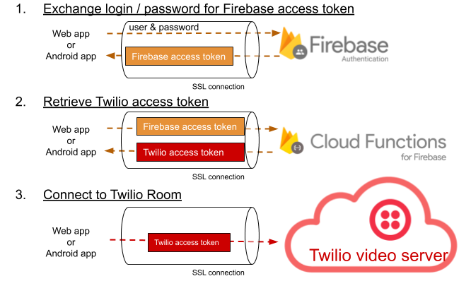
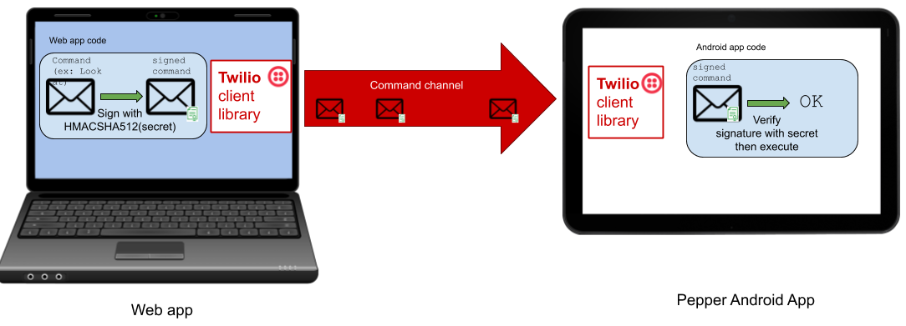
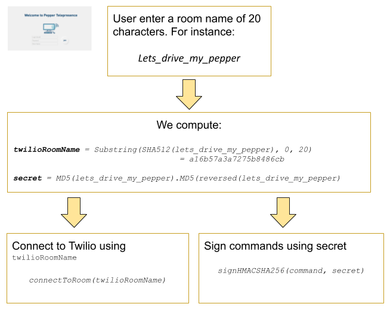

# Telepresence Application security

## Introduction

Telepresence applications are sensitive applications in term of security. If a hacker manages to break your application security, they could steal your user data, spy on them or even worse, harm them, as some telepresence scenarios involves controlling a Pepper robot that can interact with the real world.
To prevent this, **telepresence apps on Pepper must be very secure**.

We have secured the applications contained in this project, to limit the harm hackers could do. We explain here what we did, and why we did it.

## Telepresence apps general characteristics

The architectures of your telepresence or remote video applications will vary in function of your use cases. Usually, they will have in common the fact that:

- They involve several distant applications exchanging streams of audio and/or video and/or data
- The data stream they exchange contains private data
- They involve some kind of authorization mechanism to define who can access what stream of data, and when.

Moreover, in the particular case of robotic telepresence application, if you want someone to pilot a robot remotely, then

- Some distant app can send commands, that will be executed by a remote robot

In order to protect your users privacy, and prevent any damage caused to them by a malicious attacker, your application must at least ensure:

- Data streams are protected end-to-end with strong encryption
- Only authorized user have access to the streams of only their own robots and no other robots connected to the system
- Only authorized user can send commands to their own robots
- When a robot is streaming its audio/video stream, users around the robot must be clearly notified and have agreed to it

## General architecture of this project

In this project we chose to address two types of uses cases:

1. A distant person wants to make a video call with someone in front of a Pepper
2. A distant person wants to remotely pilot a Pepper robot

Both uses cases involve 2 apps (a web app for the distant person and an android app on the Pepper robot) exchanging audio / video / command streams.

To start the stream exchange, both apps must share the same secret (each peer needs to enter the same room name in each app). Each app will connect to a rendez-vous server to exchange each others ip information, and establish the audio / video /command streams.

<p align="center">
  
</p>
<p align="center">
  <em>Fig. 1. Simplified architecture</em>
</p>

In practice, to implement this, we rely on the cloud commercial services of Firebase and Twilio. Twilio Video service act as the rendez-vous server, while Firebase is used to authenticate the users and make sure they have access to the Twilio service, and also to host the web app code, as well as an HTTP API:

* Firebase Hosting hosts the code of the web app
* Both the web app and the Android app use Firebase authentication to log the users in, and obtain Firebase access tokens in exchange. These tokens are a proof that the users are logged in and authorized to access the Firebase Function API.
* Both the web app and the Android app then query an HTTP API hosted on Firebase Functions. This API returns Twilio access tokens that allow a connection to the Twilio Video service. They need to provide valid Firebase access tokens in order to access that API.
* Finally, both apps connect to the same room in the Twilio Video service. Under the hood, the Twilio Video SDK sets up audio, video and command streams.

<p align="center">
  
</p>
<p align="center">
  <em>Fig. 2. Real architecture</em>
</p>


## Security measures and good practices

Many threats exist and we cannot list every possible way to protect your app. On top of giving general advice, we present here what we did to protect the apps present in this project. So the following is a non-exhaustive list of the security measures that we implemented.

### Securing the audio, video and command streams

We rely on the Twilio SDK to secure the media streams, and are dependent on the level of security of the Twilio service. Twilio encrypt the video streams exchanged by the robot and the apps using DTLS/SRTP so that the stream cannot be spied on by any hackers performing a man in the middle attack. Depending on the function of the type of room chosen in Twilio Console, the security may vary. [We advise to use Peer-To-Peer rooms](twilio_setup#configure-twilio-video) for the strongest security. See [here](https://support.twilio.com/hc/en-us/articles/115007323447-Media-encryption-with-Twilio-Programmable-Video) for an article about Twilio securitization of the media streams.
Under the hood Twilio relies on the WebRTC technology when using a Peer-To-Peer room.

<p align="center">
  
</p>
<p align="center">
  <em>Fig. 3. Media stream are encrypted end-to-end</em>
</p>

### Making sure only authorized users access Twilio

Only authorized users must access the Twilio video service. To enforce this, the Twilio SDK needs a valid [access token](https://www.twilio.com/docs/iam/access-tokens) to connect to a room. 
We chose to provide these Twilio Tokens using a REST API hosted on Firebase Functions. This REST API is also protected and also requires an access token. These Firebase access token are provided by Firebase Authentication, in exchange of a valid users login and password. This process is summarized in the Figure 4.

<p align="center">
  
</p>
<p align="center">
  <em>Fig. 4. Authenticate users before they access Twilio</em>
</p>

Now we are sure that only the users with valid Firebase Auth login and password can access our system.

In the code of the apps you will find the following calls to Twilio and Firebase SDKs:

* `auth.signInWithEmailAndPassword` for signing into Firebase Auth
* `functions.getHttpsCallable("token").call` for calling Firebase Functions (in the web app its an ajax call to "/token" with a rewrites rule in the firebase.json, that redirect to Firebase Functions).
* `Video.connect` for connection to Twilio room

### Making sure no strangers can participate to the call

Only authorized users must access the call between the robot and the distant web app. To prevent any stranger joining the call, we rely on the fact that both the distant person and the person in front of the robot must share a secret: the room name. This secret is long enough (20 characters) to be not guessable (even with brute force) by an attacker.
For convenience we allow any room name to be chosen, as this is a demo application, we just constrain the length. In a real production app, for extra security we could have used a random hash, generated for instance by the robot Android App, and then included in an http url (something like https://pepper.telepresence.app/SecretHASH) sent by email or whatever appropriate way to the distant person.

As a extra security layer, it would also be possible to generate Twilio Access Tokens specifically for one room at a time, by specifying the room name into the `VideoGrant` when creating the Twilio Access Token (see [this](https://www.twilio.com/docs/iam/access-tokens?code-sample=code-creating-an-access-token-video-2&code-language=Node.js&code-sdk-version=3.x)). It is not done in this project.

### Making sure no distant strangers can call the robot with no one in front of the robot

In this project, a person need to explicitly start the telepresence app on the robot and to enter a room name to start a call. We are sure no distant stranger can take control of the robot when it is alone.

However in a real telepresence use case, the distant person would generally be able to take control of the robot autonomously, even if no one is physically present with the robot, and started explicitly an app. If you deploy such an app, be very cautious about your system architecture, and make sure no one can hack into the robot.

### Notifying surrounding people that the robot is controlled

This is not handled by the libraries, as all speech, sound and tablet display is handled at the application lievel. Some ways you can indicate that:

 * Using a specific sound an animation when the call starts
 * Using the tablet to explicitly state that the robot is being controlled
 * Using a specific sound when the call ends

The samples show two examples of ways this can be done:

 * In the "telepresence" sample app, during the call, the tablet shows the preview of what Pepper is filming
 * In the "drive pepper" sample, instead Pepper displays this status on tablet.


### Using a restricted list of commands that are not evaluated

One of the sample apps allows to send commands to control the robot: orientate the camera, and move the robot around. The commands are sent as JSON, then upon receiving a command, the robot Android app compares it to a list of predefined authorized commands, and executes the action corresponding to the command string.
To reach a very high security level, we could have suppressed all arguments from the commands, so that only strings are sent (commands like turn_90_degree, turn_45_degree). We chose to allow parameters though. A best practice is to check argument boundaries if they are numbers, and make sure out of bound commands cannot be send. In case of text, check the size of the text. For instance if one of the command makes the robot speak, check the text is not abnormally long and would block the robot for a long time.

### Enforcing integrity of commands send to the robot by signing them

It is critical that only the authorized remote peer can send commands to the Pepper robot it is connected to, and that no one has tampered with the command. As an extra security, we sign all the commands sent to the robot by the web application. The robot verifies the signature of all the commands it receives, and only after that can it execute them.

<p align="center">
  
</p>
<p align="center">
  <em>Fig. 5. How we compute the secret and the Twilio Room Name</em>
</p>

To sign the commands, we use a shared secret key and the HMAC SHA256 algorithm.
The secret key is derived from the room name that the user enter at the apps startup.
In fact we do not really use the room name as the Twilio Room name! We use the SHA512 of the room name. This is more clearly explained in Figure 6.

<p align="center">
  
</p>
<p align="center">
  <em>Fig. 6. How we compute the secret and the Twilio Room Name</em>
</p>


### Protecting the secret used to sign commands in the web app

To protect the secret from being stolen, for instance via XSS attacks, we use a *sandboxed iframe*, to isolate GUI inputs in the web app from the rest of the javascript code, and especially from the code that does the signing. A sandboxed iframe tag looks like this:

```
    <iframe src="login.html" sandbox="allow-scripts"></iframe>
```

In practice these tags isolate the code of the login.html page from the parent page. The secret passphrase is filled in the login.html page, then passed to the parent page. The parent page in turn unloads the login page, and load the control page room.html in the sandboxed iframe. Now only the parent page contains the secret, and an attack on the room.html controls cannot steal it.

