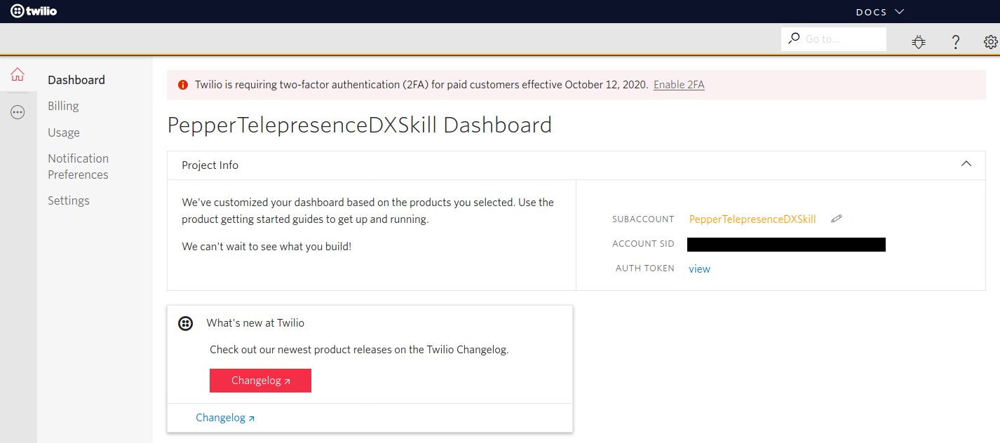
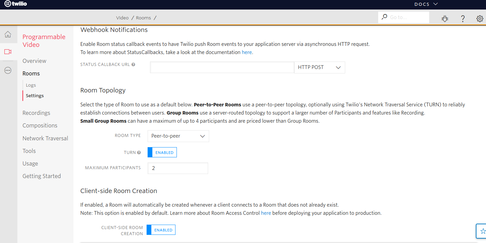

# Create and Setup your Twilio Account

## Account creation

This repository uses the [Twilio Video SDK](https://www.twilio.com/video) under the hood to establish the audio/video connection between Pepper and a web app. In order to use the Twilio SDK, you need to create a [Twilio](https://www.twilio.com/) account by registering on [https://www.twilio.com/try-twilio](https://www.twilio.com/try-twilio).

## Configure Twilio Video

Twilio provides several [commercial services](https://www.twilio.com/products). You will be using Twilio Programmable Video in this app. You can find a lot of information on Programmable Video in the dedicated documentation [here](https://www.twilio.com/docs/video)

To configure Twilio Video, first log in to [Twilio console](https://www.twilio.com/console) using your newly created account.

  

Then access the dedicated Video configuration page by going to the [Room settings page](https://www.twilio.com/console/video/configure):

  

Twilio uses the concept of _Rooms_ in their Video SDK. Briefly, to establish an audio/video call between two parties, both have to join the same _room_. Twilio Rooms have a Type, and a maximum number of participants. You can learn more on Twilio rooms in the [documentation](https://www.twilio.com/docs/video/tutorials/understanding-video-rooms). For our specific use case, setup the room settings as in the screenshot above:

* Chooose "Peer-to-peer" for ROOM TYPE
* Set TURN to "ENABLED"
* Set the MAXIMUM PARTICIPANTS to "2"
* Set CLIENT-SIDE ROOM CREATION to "ENABLED"

Then click on the *Save* button.

## Retrieve a temporary Twilio Access Token

You will need a temporary Twilio access token if you want to quicktest the Pepper Android app and the  associated Web app.

To retrieve a Twilio Access Token, go to the [Testing Tools page](https://www.twilio.com/console/video/runtime/testing-tools), enter a name in the *CLIENT IDENTITY* field, leave the field *Choose your room name* empty, and click on *Generate Access Token*:

  

The Twilio Access Token you will obtain is a long JWT string that looks like this:

        eyJ0eXAiOiJKV1QiLCJhbGciOiQWERTY1NiIsImN0eSI6InR3aWxpby1mcGE7dj0xIn0.eyJqdGkiOiJTSzhkOWE0Mm
        E5NTllMTk5YTNlOGIyZDE3ZmEzOWZiZjBlLTE1OTY0NjA5ODAiLCJpc3MiOiJTSzhkOWE0MmE5NTllMTk5YTFDOGIyZ
        DE3ZmEzOWZiZjBlIwwic3ViIjoiQUM3ZTXZNzA3ZGQ0ZDE3NmJmMzdmZsngwODM5ZmYxOGUzMiIsImV4cCI6MTU5NjQ
        2NDU4MCwiZ3JhbnRzIjp7ImlkZW50aXR5IjoidG90byIsInZpZGVvIjp7fX19.vVEcRNPyoyotystFndbecjhXw6IUU
        PNyAypIq4oFB5c

Beware: For the *CLIENT IDENTITY*, you MUST choose a different name for each of the apps where you use a Twilio token. For instance choose "Pepper" for the Access Token you will paste in the Android app, and choose "Operator" for the Twilio token you use in the Web App.

## Retrieve Twilio configuration ids

You will need Twilio configuration ids to run the web app on Firebase cloud.

You will need to gather:

- **Account SID**: Your primary Twilio account identifier - find this [in the console here](https://www.twilio.com/console).
- **API Key SID**: Used to authenticate - [generate one here](https://www.twilio.com/console/runtime/api-keys).
- **API Key Secret**: Used to authenticate - [just like the above, you'll get one here](https://www.twilio.com/console/runtime/api-keys).

When you generate an API key pair at the URLs above, your API Key Secret will only
be shown once - make sure to save this in a secure location,
or possibly your `~/.bash_profile`.
