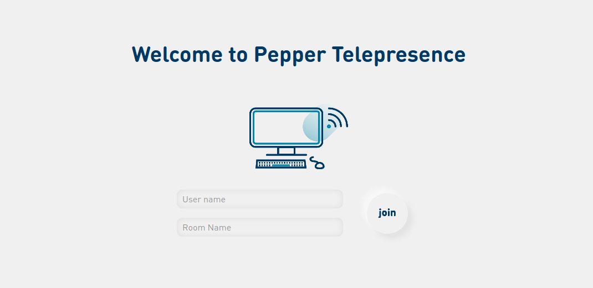
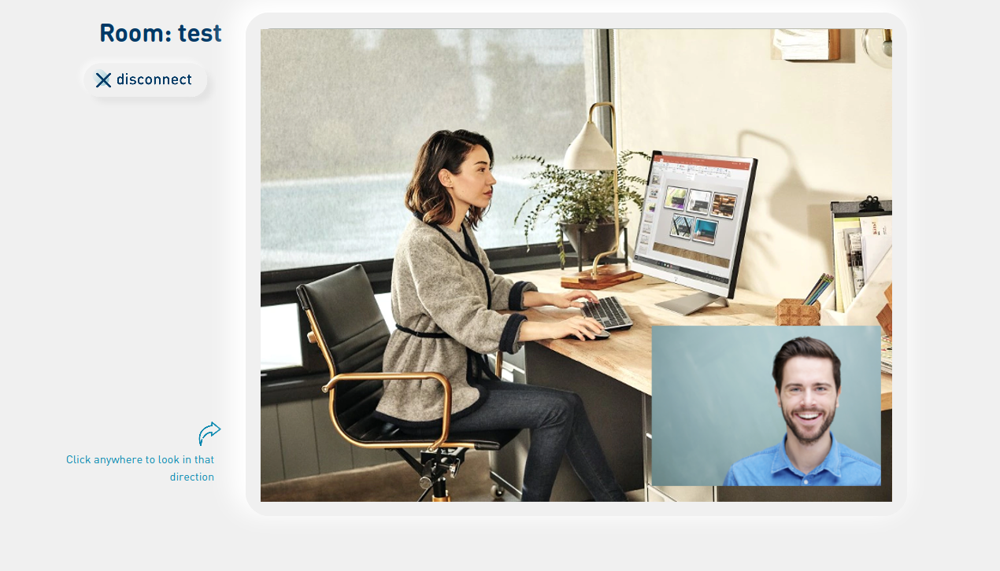
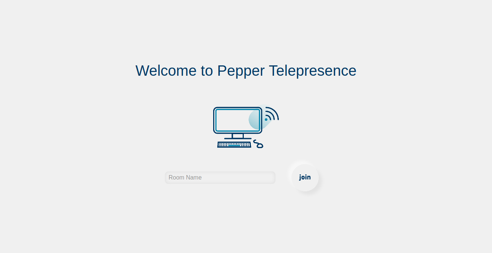
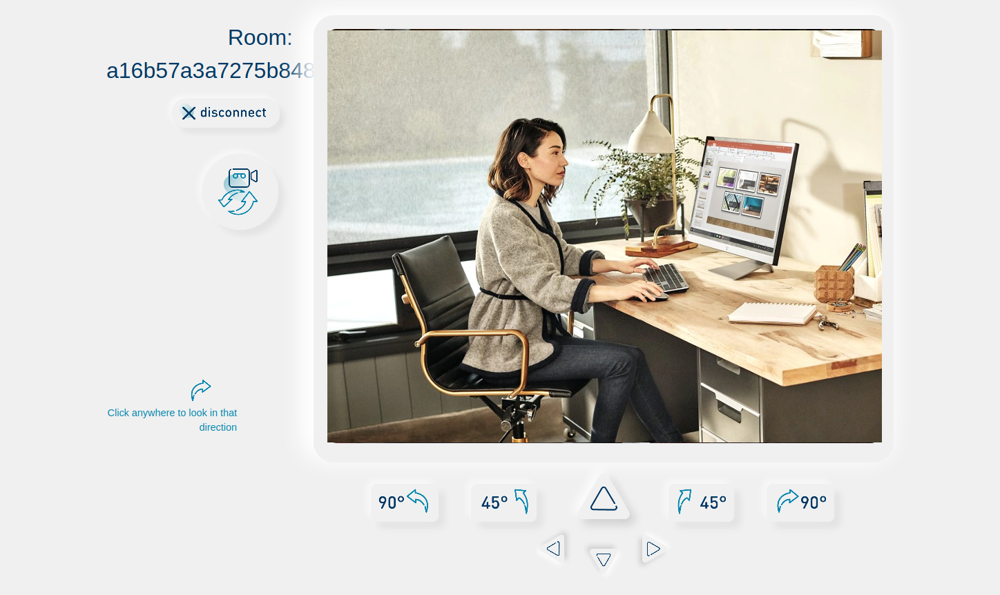
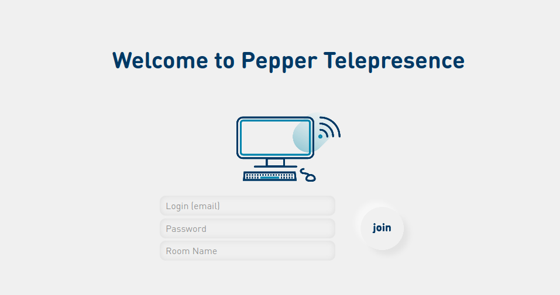
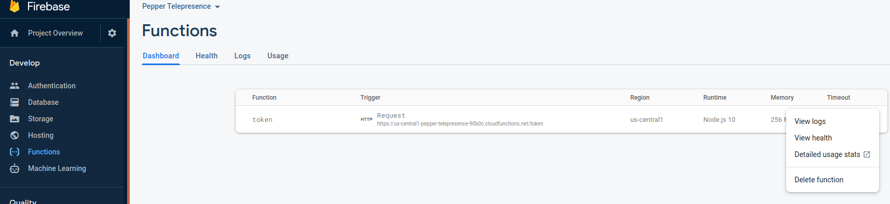

# Pepper Telepresence Web App

## Overview

This application provides a sample web interface allowing you to call a Pepper robot via Telepresence.
It is intended to be used with the [Pepper Telepresence Library and Quickstart for Android](../android/README.md). The code of this web application is based on the Twilio Quickstart available at
[https://github.com/twilio/video-quickstart-js](https://github.com/twilio/video-quickstart-js)

## Prerequisite

To run this application, you will need:

* A Twilio account. See [here](../doc/twilio_setup.md) for instructions on how to set it up.
* Node JS version 12 or above.
* [Optional] If you want to deploy this solution to a server, you can do it on Firebase Cloud. In that case you will also need a [Firebase account and to create a Firebase project](../doc/firebase_setup.md).

## Run the application locally

To test the web app on your computer, follow these steps:

1. [Retrieve a Twilio Access Token](../doc/twilio_setup.md#retrieve-a-temporary-twilio-access-token) (These tokens have a short lifetime of 1 hour. You will have to retrieve another token once 1 hour has elapsed).

2. Edit the [src/index.js](src/index.js) file, and replace

        TWILIO_TOKEN = "eyXXXX.eyXXXX.YYYY";

    With the the Twilio access token string copied from the console.

        TWILIO_TOKEN = "eyJ0eXAiOiJKV1QiLCJhbGciOi....."

3. Install all node dependencies

    ```
     npm install
    ```

4. Serve the web app and access it from [http://localhost:5000](http://localhost:5000)

    ```
     npm start
    ```

## Use the Web app to connect to the app-telepresence Android app on Pepper

Access the web app at the url [http://localhost:5000](http://localhost:5000).

  

You will be prompted to choose a _User name_, Pepper will use that name to announce you when you connect via telepresence. Then you will have to enter a _Room Name_ (you need to choose a _Room Name_ that is at least 20 characters) and to click on the *join* button.

You will then be prompted to allow to use your microphone and camera.

Now, go to the Pepper app-telepresence Android app, and connect to the same *Room*. Once connected  you'll be able to see, hear and speak through Pepper.

  

## Use the Web app to connect to the app-remote-control Android app on Pepper

Access the web app at the url [http://localhost:5000?mode=operator](http://localhost:5000?mode=operator).

  

You will be prompted to choose a _Room Name_ and to click on the *join* button. You need to choose a _Room Name_ that is at least 20 characters.

You will then be prompted to allow to use your microphone and camera.

Now, go to the Pepper app-remote-control Android app, and connect to the same *Room*. Once connected  you'll be able to see, hear through Pepper.

  

The interface allows you to control Pepper, and in particular:

* Switch between pepper cameras: app can use Pepper head camera or Pepper tablet camera.
* Move Pepper around. Make sure that Pepper has enough space around it and that hatch is closed.


## Deploy the application in Firebase cloud

This web application was made to be deployable directly to [Firebase Cloud](https://firebase.google.com/), and used in production. To deploy it to Firebase, follow these step:

1. [Collect Twilio configuration ids](../doc/twilio_setup.md#retrieve-twilio-configuration-ids) (Twilio Account SID, Twilio API Key SID, Twilio API Key Secret). 

2. Install firebase-cli:

    ```
    npm install -g firebase-tools
    ```

3. Log in to firebase:

    ```
    firebase login
    ```

4. Connect your Firebase project to this folder (choose the project you just created and the alias you want, any is fine):

    ```
    firebase use --add
    ```

5. Install all node dependencies

    ```
    npm install && ( cd functions && npm install )
    ```

6. Set Twilio variable info firebase environment:

    ```
    firebase functions:config:set twilio.account_sid="ACXXXXXXXXXXXXXXXXXX"  twilio.api_key="SKXXXXXXXXXXXXXXXXXXXXXXXXXX" twilio.api_secret="SecretXXXXXXXXX"
    ```

7. Then deploy it to Firebase Cloud and access it using the url which is displayed in your console:

    ```
    firebase deploy
    ```

### Start Firebase version locally

You can start Firebase version locally, for this do the following:

1. Set the variables locally:

    ```
    firebase functions:config:get > .runtimeconfig.json
    ```

2. Start the application locally, and access it from [http://localhost:5000](http://localhost:5000):

    ```
    npm run firebase_local
    ```


## Use the Web app deployed in Firebase to connect to the app-telepresence Android app on Pepper

Access the Web app from the url that was displayed when you ran `firebase deploy`. When deployed to Firebase, the Web app requires that you log in using one of the [email/password accounts that you configured in Firebase auth](../doc/firebase_setup.md#add-emailpassword-accounts)

  

Then once logged in, the application is the same as in the [local version](#use-the-web-app-to-connect-to-the-app-telepresence-android-app-on-pepper)

## Use the Web app deployed in Firebase to connect to the app-remote-control Android app on Pepper

Access the Web app from the url that was displayed when you ran `firebase deploy`, and append `?mode=operator` at the end of the url. When deployed to Firebase, the Web app requires that you log in using one of the [email/password accounts that you configured in Firebase auth](../doc/firebase_setup.md#add-emailpassword-accounts)

  

Then once logged in, the application is the same as in the [local version](#use-the-web-app-to-connect-to-the-app-remote-control-android-app-on-pepper)

## Undeploy the application from Firebase

When you are done with testing, undeploy the application from firebase cloud, to prevent anyone accessing it and consumming video time from your Twilio account.

### Delete Firebase functions

To do this, go to [firebase console](https://www.twilio.com/console) then go to the Functions tab, click on the three vertical dots (...) next to the _token_ function and click _Delete function_.

  


### Delete Firebase hosting

You can do this using the command line, just type:

```bash
firebase hosting:disable
```

That's it, you are done !